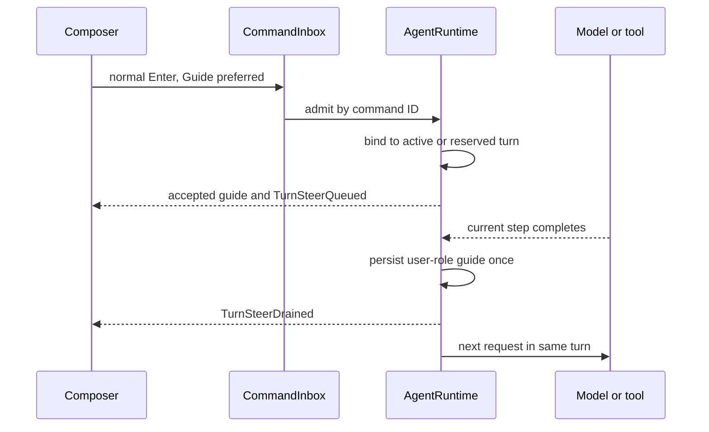

# Guide steering during an active ZCode turn

## Product rule

With the session's Guide interaction behavior selected, a normal Enter sent while the session owns a regular foreground turn is a steering message for that same turn. It does not stop the turn, discard completed tools, or create another product turn. The message is a real user-role entry in the next model request. If a provider request or tool call is in flight, that work finishes first. If the turn is still preparing its first model request, the guide is included before that request. A guide arriving after the turn has completed is an ordinary new turn.

Explicit Send now remains the separate preempting action. Queue mode remains a future-turn action. Compact, goal verification, attachments unsupported for inline Guide, and permission or promotion barriers retain their queue behavior with an observable fallback reason.

## Authority and interfaces

- The session projection owns the persisted `followupMode` preference. The renderer submits a message and optional explicit delivery override; it does not decide runtime busy state or maintain an accepted queue.
- `CommandInbox` serializes command admission. Core `AgentRuntime` owns the active turn, its start reservation, and pending Guide inputs. It chooses `startNow`, `guide`, or `queue` at admission using its own current state and the supplied session preference. A stale `inputRouting.mode` must not change a Guide-preferred busy send into a future queue item.
- The accepted-input result reports the actual admission delivery. Existing `TurnSteerQueued`, `TurnSteerDrained`, and `TurnSteerDeliveryChanged` events carry pending, applied, and fallback state to desktop continuous projection and Web replay. No second renderer or Host queue is introduced.
- The command ID and existing queue item ID remain the idempotency keys across retries, reconnect, reservation transfer, and promotion. A Guide input is recorded exactly once as a user message.

## Event order

A guide accepted against a start reservation transfers to the matching active turn before its first provider request. If the reserved turn fails before it can run, Core changes that input to a visible ordinary queue item with a fallback reason. If completion wins before admission, Core starts the new input normally; it does not resurrect a completed turn. Explicit Send now uses its existing lease and cancellation path.

## Acceptance

1. A normal Enter during model streaming, a tool call, or the start-reservation window is accepted as Guide and appears once within the original product turn; no cancellation event occurs.
2. A text-only model step with a pending Guide continues the same turn and includes the new user entry in the next provider request.
3. Queue mode, explicit Send now, maintenance phases, unsupported attachments, errors, and reservation failure preserve their documented routing and visible fallback state.
4. Desktop continuous delivery and Web remote replay/reconnect render the same admitted delivery and message history without duplication.
