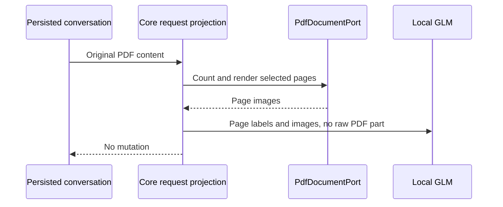

# Local GLM-5.3-Flash in the installed ZCode fork

## Product rule

The personal provider named `Local` connects to the existing authenticated OpenAI Chat
Completions gateway at `http://192.168.0.33:8000/v1` using the exact wire model ID
`glm-5.3-flash`. Its context window is 1,048,576 tokens. Recommended mode leaves the
personal output-token override absent and inherits the catalog's 128,000-token maximum.
It is the default for new chats; existing chats and the Z.ai provider remain intact.
Display labels may be `GLM-5.3-Flash` and `Low`/`High`/`Max`, while wire IDs and efforts
stay lowercase. The API key lives only in the user's private provider configuration.

The local endpoint supports image and video input, tools, JSON schema output, and
top-level `reasoning_effort`. Native web search and audio are unavailable. Its vLLM chat
parser does not accept a raw PDF file part. A model-specific `pdfInputMode` setting has
`native` and `rendered-pages` values, defaults to `native` for existing providers, and
is `rendered-pages` for Local. The PDF switch is enabled only with the conversion path.
Guide steering remains a user-role message.

## Ownership and request boundary

Provider/model configuration owns the `pdfInputMode` value, capability flags, exact
wire IDs, and reasoning parameter map. The shared Core model-request projection owns
conversion of PDF content for `rendered-pages` models. It operates on a request copy
after media budget selection, including PDF blocks from composer attachments and Read
tool results. Persistent chat history, attachments, and replay retain their original
PDF blocks. The existing `PdfDocumentPort` owns page counting and rendering; its
desktop adapter uses packaged PDF.js rendering so no external Poppler install is needed.
Native-PDF providers keep their current wire representation.

At most 20 PDF pages are rendered across one provider request. A document or selected
range exceeding the remaining limit fails before the provider request with a clear
page-range message. The user can request a bounded range with Read. Invalid PDFs,
rendering failures, and cancellation use the existing PDF error path; they must never
silently drop pages or send an unsupported raw file part. The projection owns no new
persistent queue or cache. A retried/replayed request derives the same bounded pages
from the original PDF, and a stale or cancelled render cannot mutate history.

## Acceptance

1. Effective Local settings show the exact context, inherited output cap, supported
   switches, Local default, and the lowercase wire model/effort with title-case UI text.
2. Composer PDFs and Read-result PDFs become labeled page images in Local requests;
   the original PDF stays in history and remote replay. A two-page PDF yields two
   distinct page images. The aggregate 20-page limit gives a clear range error.
3. Native-PDF providers continue receiving their original file parts.
4. Disposable desktop and Web chats exercise Low/High/Max, tools, structured JSON,
   photo, short video, and a two-page PDF. Model Test alone is not acceptance.
5. Freshness, architecture, relevant tests, typecheck, lint, formatting, signed
   packaging, install, and post-install state checks pass before declaring completion.

## Migration and installation

The new optional setting reads absent values as `native`, so existing personal rules
and saved sessions need no migration. The installed fork keeps its existing bundle ID
and `~/.zcode` location. A validated fork-main build is installed while ZCode is idle,
after app and data snapshots. Failed installation restores both snapshots. The older
local branch remains untouched.
