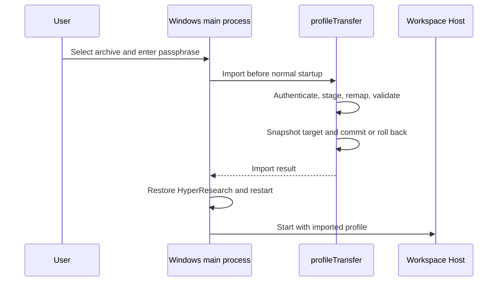

# Windows 11 ZCode transfer

## Product behavior

- A Windows x64 build of this fork can import one encrypted transfer archive on first launch, before any workspace Host or session database starts. The first-launch prompt may be skipped; an explicit `--import-mac-setup` launch reopens it. Normal launches and existing Windows profiles are not silently replaced.
- A Mac-side exporter creates a private, versioned `.zcode-transfer` file from the current ZCode profile and the current clean HyperResearch source/workspace. The exporter requires a locally entered passphrase and never prints credentials or writes an unencrypted archive. The public installer and source tree contain no personal data or internal gateway address.
- The transfer carries provider and model settings, including the Local default and HyperResearch Local; settings; all saved chats and the two SQLite indexes; chat media, relevant ZCode memories and agent traces; and the HyperResearch research workspace. Original message and tool text remains historical. Mac-specific executable paths in active metadata are rewritten to Windows paths.
- The Windows app retains this fork's identity, Guide steering, Local image/video/PDF/JSON/tool behavior, and disabled official updates. Built-in plugins come from the Windows app. Shared Paseo skills and Mac plugin caches are outside this transfer.

## Ownership and interfaces

- The Desktop main process owns the first-launch prompt, native file selection, passphrase entry, and the decision to restart after import. It must finish import before creating a window-scoped Host. UI input is transient and is never persisted or logged.
- `profileTransfer` owns the versioned archive, encryption, allowlisted payload, profile snapshot, import validation, path migration, and atomic profile replacement. The Mac exporter and Windows main process call this one implementation; neither duplicates profile mutation logic.
- The archive has a small unencrypted version/salt/nonce header and an AES-256-GCM encrypted ZIP payload. Derive the key with scrypt from a passphrase entered in a local prompt. Authenticate before extraction; limit entry count and expanded bytes; reject absolute paths, traversal, links, duplicate entries, unknown mandatory versions, and corrupt SQLite. The archive contains no Mac-bound OAuth ciphertext, device identity, TLS private key, Chromium user data, execution caches, or logs.
- `hyperResearchTransfer` stages a Git bundle for the exact clean source commit and the research workspace, then restores it on Windows under the user's Projects directory. It installs Python 3.12 and locked `mcp`/`crawl4ai` dependencies with `uv`, installs Chromium for Playwright, regenerates ZCode global/workspace skill and agents, and writes a `cmd`-compatible Stop hook. Git for Windows and `uv` are prerequisites; missing tools yield actionable retry instructions. Do not copy the Mac virtual environment or its generated command paths.
- The Mac source profile and any preexisting Windows profile stay intact. Import stages beside the target profile, snapshots an existing target, migrates known active SQLite identity/path columns and settings fields, then swaps into place. A failure before commit leaves the target unchanged; a failure during commit restores its snapshot. The HyperResearch dependency setup follows profile commit and can be retried without importing the archive again.

## Migration and failure semantics

- Map the default workspace and transferred HyperResearch workspace to their Windows counterparts. Preserve sessions whose temporary Mac workspace no longer exists under a labeled empty imported workspace; keep them archived and report that their original external files are unavailable.
- Preserve chat IDs, message order, provider selection, and the Local default. Remap `session.directory`, `session.path`, path-derived project/workspace identity keys, relevant permission/input-history identifiers, task-index workspace keys, and active workspace paths in settings/metadata. Do not rewrite historical prompt or tool-output prose.
- Remap project memory directory names derived from Mac workspace paths to their Windows workspace identities so imported memories remain active. Preserve opaque workspace-ID memory names.
- Keep Local's exact lowercase wire model ID, 1,048,576-token context, blank personal output override, rendered-page PDF mode, and working capability switches. The Windows controls continue to show the user-facing model and effort casing. The gateway stays on the same LAN; the transfer does not include model weights or server state.
- Z.ai sign-in must be repeated because its current credential ciphertext is machine-bound. Windows generates fresh device and TLS state and repopulates official plugin caches. A bad passphrase, invalid archive, unsupported version, occupied target, missing dependency, or interrupted setup must produce a clear state and a retry path without exposing secrets.

## Acceptance

- Export/import fixtures round-trip provider settings, chat counts and IDs, media references, memories, and workspace identities. Wrong passphrase, corrupt/path-traversal/oversized archive, occupied-target backup, and interrupted commit tests leave prior data usable.
- Run freshness, architecture, relevant tests, `pnpm typecheck`, `pnpm lint`, and `pnpm fmt:check`. Build the x64 NSIS installer on Windows and launch its packaged runtime; check native modules, PDF.js resources, built-in plugins, app identity, and About commit.
- Deliver a private kit containing the installer, encrypted transfer file, checksums, and short setup instructions. After transfer, check imported chats/settings, Local connectivity and Low/High/Max, a tool call, JSON, photo, video, two-page PDF, Guide steering, HyperResearch with Git Bash as its session shell, and remote Web replay on the actual Windows 11 PC. Do not report those on-device checks as passed before they run.
